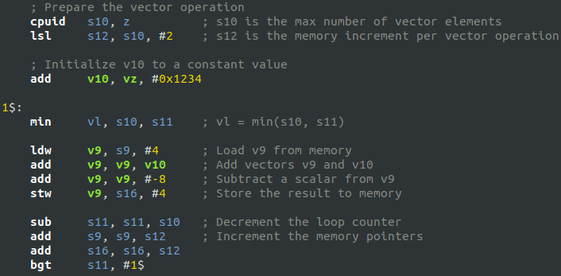

# MRISC32 simulator

This repository contains a simulator for the [MRISC32 ISA](https://github.com/mrisc32/mrisc32), and some relevant tools.


## Simulator

The MRISC32 simulator is a C++ program that can run MRISC32 binaries. See [sim/README.md](sim/README.md).


## Building programs

There is a GNU toolchain capable of compiling and linking C and Assembly source code programs for MRISC32. For futher information see [mrisc32/mrisc32-gnu-toolchain](https://github.com/mrisc32/mrisc32-gnu-toolchain).

To build assembly language programs that can be used by the simulator or the VHDL testbench (core_tb), do the following:

```bash
$ mrisc32-elf-as -o my-program.o my-program.s
$ mrisc32-elf-ld -o my-program.elf my-program.o
$ mrisc32-elf-objcopy -O binary my-program.elf my-program.bin
```

The final `.bin` file can be loaded into the simulator, for instance.


## Debug trace inspector

Debug traces from the simulator or the VHDL test bench can be inspected using `mrisc32-trace-tool.py`. It can be useful for finding differences between different simulation runs.


## Syntax Highlighting



### gedit / GtkSourceView

Copy or symlink `tools/support/gtksourceview/mr32asm.lang` to `~/.local/share/gtksourceview-3.0/language-specs/`.

For GtkSourceView 4 (e.g. used in gedit in Ubuntu 19.04 and later), copy to `~/.local/share/gtksourceview-4/language-specs/` instead.
